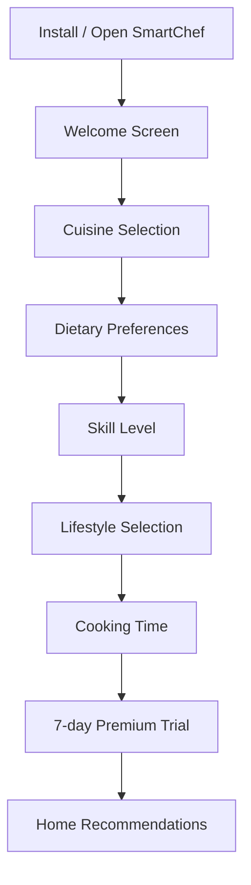
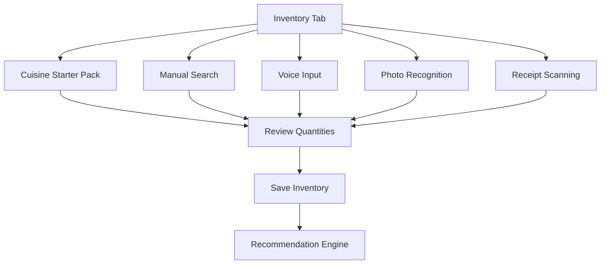
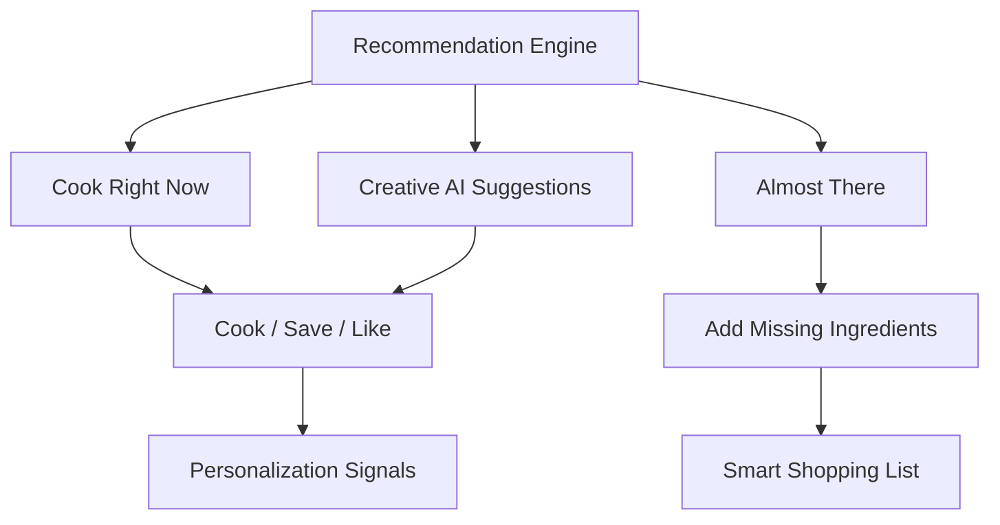

# SmartChef AI Product Requirements Document

## Executive Summary
SmartChef AI is a mobile-first cooking assistant that solves the daily "what should I cook?" decision. It combines user preferences, digital ingredient inventory, dietary habits, cooking time, lifestyle context, and AI generation to recommend meals users can cook immediately, meals that need only a few extra ingredients, and creative dishes they may not have considered.

The product is designed for international students, bachelors, busy professionals, families, and health-conscious users who want quick, affordable, low-waste meals without managing a complex meal-planning system.

## Product Goals
- Recommend daily meals across breakfast, lunch, dinner, and snacks.
- Build a useful food inventory in less than 30 seconds.
- Reduce waste by prioritizing ingredients near expiration.
- Generate quick, affordable, easy recipes using current inventory.
- Personalize recommendations over time using likes, dislikes, history, budget, and cooking time.
- Convert new users through a 7-day unrestricted Premium trial.

## Target Users
- International students managing limited budgets, shared kitchens, and unfamiliar grocery habits.
- Bachelors or people living alone who want simple meals with minimal cleanup.
- Working professionals who need quick dinner decisions.
- Family households planning weekly meals.
- Fitness enthusiasts looking for high-protein or calorie-aware meals.

## MVP Scope
- Mobile onboarding with cuisine, diet, skill, lifestyle, cooking time, and Premium trial.
- Smart starter packs for Desi, Italian, and Chinese cuisines.
- Inventory addition via starter pack, manual search, voice-text extraction, photo scan simulation, and receipt scan simulation.
- Daily recommendation categories: Cook Right Now, Almost There, Creative AI Suggestions.
- Quick Meals Mode for students, bachelors, professionals, and low-time users.
- Shopping list generation from missing ingredients.
- Weekly meal plan modes: Budget, Healthy, Family, High Protein, Weight Loss, Student, Bachelor.
- Premium trial and subscription plan selection.
- Solo-founder budget preview and customer feedback capture.

## Out of MVP
- Creator recipe marketplace.
- Creator monetization, video uploads, creator channels, leaderboards, comments, and revenue dashboards.
- Grocery delivery integrations.
- Full nutrition database certification.
- Real-time collaborative family inventory.

## Onboarding Flow
1. Welcome: "Never wonder what to cook again."
2. Select multiple preferred cuisines.
3. Select dietary preferences.
4. Select cooking skill level.
5. Select one or more lifestyle profiles.
6. Select available cooking time.
7. Activate unrestricted 7-day Premium trial.

## Functional Requirements
- Store preferences in user profile.
- Use cooking time to filter and rank recommendations.
- Detect lifestyle users eligible for Quick Meals Mode.
- Add all starter pack ingredients with one action while allowing quantity edits.
- Track ingredient quantity, category, source, added date, expiry date, and confidence score.
- Flag ingredients expiring within 1-3 days.
- Generate daily recipe recommendations and explain missing ingredients.
- Add missing ingredients to shopping list.
- Save, like, dislike, and share recipes.
- Generate weekly meal plans by mode.
- Track Premium trial start, expiry, reminder notification, plan selection, and conversion.

## User Flow Diagrams







## Mobile Wireframes

```text
WELCOME                 CUISINES                HOME
+----------------+      +----------------+      +----------------+
| Never wonder   |      | Select cuisine |      | Today          |
| what to cook   |      | [Desi] [Thai]  |      | AI Pick        |
| again          |      | [Italian] ...  |      | Cook Right Now |
| benefits grid  |      | Continue       |      | Almost There   |
+----------------+      +----------------+      +----------------+

INVENTORY               PLAN                   PREMIUM
+----------------+      +----------------+      +----------------+
| 30-sec setup   |      | Weekly Plan    |      | 7-day trial    |
| Packs/Search   |      | Mode chips     |      | Monthly        |
| Voice/Scan     |      | Meal cards     |      | Annual Save 33 |
| Ingredient list|      | Shopping list  |      | Admin preview  |
+----------------+      +----------------+      +----------------+
```

## UI Design System
- Personality: premium, fast, warm, useful.
- Design inspiration: Duolingo simplicity, Spotify personalization, Pinterest discovery, Uber Eats food appetite.
- Layout: mobile-first single-column screens, sticky top app bar, segmented controls, large recipe visuals, compact repeated cards.
- Light theme: warm off-white background, white surfaces, green primary, orange accent, gold highlights.
- Dark theme: deep green-black background, high-contrast surfaces, same brand accents.
- Components: primary buttons, ghost buttons, icon buttons, chips, segmented controls, recipe cards, inventory rows, plan cards, pricing cards.
- Motion: quick step transitions, button press scaling, looping product demo animation.

## Monetization
- New users receive full Premium access for 7 days.
- Trial messaging must clearly state no feature restrictions, cancel-anytime policy, full AI access, and reminder before billing.
- Monthly plan: $4.99/month.
- Annual plan: $39.99/year, displayed as "Most Popular - Save 33%".

## Operator Dashboard Requirements
- User analytics: activation, retention, daily active users, cooking streaks.
- Recipe management: approve, edit, tag, and measure recipe performance.
- Ingredient database: aliases, categories, expiry defaults, regional names.
- Recommendation monitoring: CTR, cook completion, missing-ingredient rates.
- Subscription analytics: trial starts, trial reminders, conversions, churn, MRR, ARR.
- Revenue and retention reporting by cohort, lifestyle segment, and acquisition source.

## Development Roadmap
- Weeks 1-2: product design, schema, auth, onboarding, profile storage.
- Weeks 3-4: inventory MVP, starter packs, manual add, expiry tracking.
- Weeks 5-6: AI recommendation service, recipe generator, shopping list.
- Weeks 7-8: weekly planner, nutrition and cost estimates, Premium trial.
- Weeks 9-10: lightweight operator dashboard, analytics, QA, beta release.
- Weeks 11-12: App Store / Play Store hardening, monitoring, launch.

## Phase 2
- Real Vision API grocery photo detection.
- Receipt OCR integrations.
- Pantry barcode scanning.
- Family/shared household inventory.
- Grocery store price integrations.
- Push notification personalization.
- Recipe reels browsing without creator monetization.

## Phase 3
- Creator Recipe Marketplace.
- Video uploads, creator channels, follower graph, comments, ratings.
- Creator verification badges and leaderboards.
- Creator revenue dashboard.
- Revenue share based on views, watch time, engagement, premium content, and sponsored campaigns.

## Success Metrics
- Onboarding completion rate above 70%.
- Inventory created in under 30 seconds for starter pack users.
- Day-7 retention above 35%.
- Trial-to-paid conversion above 20%.
- Weekly active cooking completion above 2 meals per active user.
- Reduction in expired inventory items over first 30 days.
